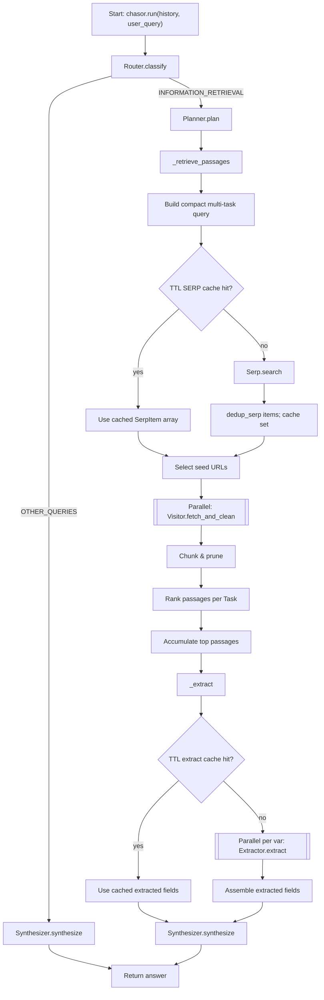
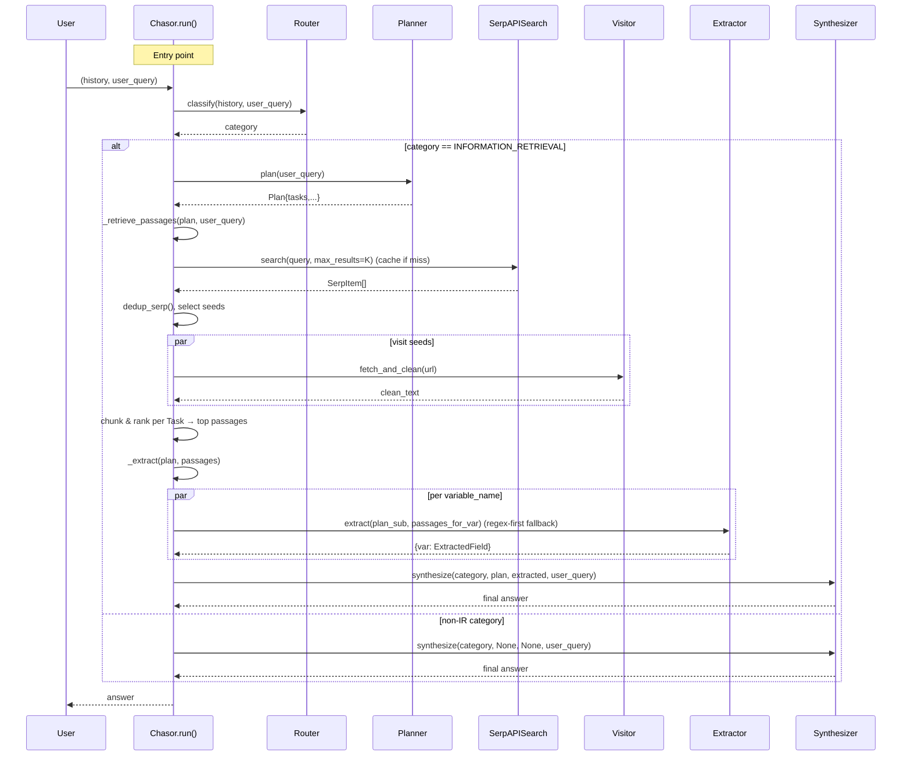

```mermaid
flowchart TD
    A["Start: chasor.run(history, user_query)"] --> B[Router.classify]
    B -->|INFORMATION_RETRIEVAL| C[Planner.plan]
    B -->|OTHER_QUERIES| Z["Synthesizer.synthesize"]

    C --> D["_retrieve_passages"]
    D --> D1[Build compact multi-task query]
    D1 --> D2{TTL SERP cache hit?}
    D2 -->|yes| D3["Use cached SerpItem array"]
    D2 -->|no| D4["Serp.search"]
    D4 --> D5[dedup_serp items; cache set]
    D3 --> E[Select seed URLs]
    D5 --> E

    E --> F[["Parallel: Visitor.fetch_and_clean"]]
    F --> G[Chunk & prune]
    G --> H[Rank passages per Task]
    H --> I[Accumulate top passages]

    I --> J["_extract"]
    J --> J1{TTL extract cache hit?}
    J1 -->|yes| K[Use cached extracted fields]
    J1 -->|no| L[["Parallel per var: Extractor.extract"]]
    L --> M["Assemble extracted fields"]

    K --> N["Synthesizer.synthesize"]
    M --> N
    Z --> O[Return answer]
    N --> O[Return answer]
```

```mermaid
sequenceDiagram
    participant U as User
    participant CH as Chasor.run()
    participant R as Router
    participant P as Planner
    participant S as SerpAPISearch
    participant V as Visitor
    participant X as Extractor
    participant Y as Synthesizer
    Note over CH: Entry point

    U->>CH: (history, user_query)
    CH->>R: classify(history, user_query)
    R-->>CH: category

    alt category == INFORMATION_RETRIEVAL
      CH->>P: plan(user_query)
      P-->>CH: Plan{tasks,...}

      CH->>CH: _retrieve_passages(plan, user_query)
      CH->>S: search(query, max_results=K) (cache if miss)
      S-->>CH: SerpItem[]
      CH->>CH: dedup_serp(), select seeds

      par visit seeds
        CH->>V: fetch_and_clean(url)
        V-->>CH: clean_text
      end

      CH->>CH: chunk & rank per Task → top passages

      CH->>CH: _extract(plan, passages)
      par per variable_name
        CH->>X: extract(plan_sub, passages_for_var) (regex-first fallback)
        X-->>CH: {var: ExtractedField}
      end

      CH->>Y: synthesize(category, plan, extracted, user_query)
      Y-->>CH: final answer
    else non-IR category
      CH->>Y: synthesize(category, None, None, user_query)
      Y-->>CH: final answer
    end

    CH-->>U: answer
```